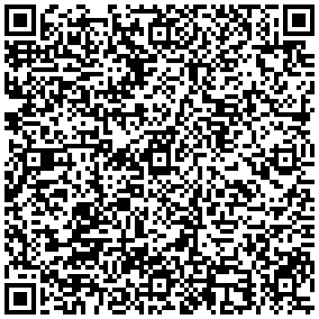

# QR Platba

[](https://packagist.org/packages/miskith/qr-platba)
[](https://packagist.org/packages/miskith/qr-platba)
[](https://travis-ci.com/miskith/QRInvoice)

Knihovna pro generování QR plateb v PHP. QR platba zjednodušuje koncovému uživateli
provedení příkazu k úhradě, protože obsahuje veškeré potřebné údaje, které stačí jen
naskenovat. Nově lze použít i jiné měny než CZK a to pomocí metody ```setCurrenty($currency)```.

Tato knihovna umožňuje:

- zobrazení obrázku v `````` tagu, který obsahuje v ```src``` rovnou data-uri s QR kódem, takže vygenerovaný
obrázek tak není třeba ukládat na server (```$qrInvoice->getQRCodeImage()```)
- uložení obrázku s QR kódem (```$qrInvoice->saveQRCodeImage()```)
- získání data-uri (```$qrInvoice->getQRCodeImage(false)```)
- získání instance objektu [QrCode](https://github.com/endroid/QrCode) (```$qrInvoice->getQRCodeInstance()```)

QRPlatbu v současné době podporují tyto banky:
Air Bank, Česká spořitelna, ČSOB, Equa bank, Era, Fio banka, Komerční banka, mBank, Raiffeisenbank, ZUNO.


Podporuje PHP ^7.3||^8.0.

## Instalace pomocí Composeru

`composer require miskith/qr-platba`

## Příklad QR platby

```php
<?php

require __DIR__ . '/vendor/autoload.php';

use miskith\QRInvoice\QRInvoice;

$qrInvoice = (new QRInvoice)
    ->setAccount('12-3456789012/0100')
    ->setVariableSymbol('2016001234')
    ->setMessage('Toto je první QR platba.')
    ->setSpecificSymbol('0308')
    ->setSpecificSymbol('1234')
    ->setCurrency('CZK') // Výchozí je CZK, lze zadat jakýkoli ISO kód měny
    ->setDueDate(new \DateTime());

echo $qrInvoice->getQRCodeImage(); // Zobrazí  tag s kódem, viz níže
```


Lze použít i jednodušší zápis:

```php
echo QRInvoice::create('12-3456789012/0100', 987.60)
    ->setMessage('QR platba je parádní!')
    ->getQRCodeImage();
```
## Příklad QR faktury a platby v jednom

```php
<?php

require __DIR__ . '/vendor/autoload.php';

use miskith\QRInvoice\QRInvoice;

$qrInvoice = QRInvoice::create('27-16060243/0300', 495.00, '012150672')
    ->setInvoiceId('012150672')
    ->setDueDate(new \DateTime('2015-12-17'))
    ->setInvoiceDate(new \DateTime('2015-12-01'))
    ->setTaxDate(new \DateTime('2015-12-01'))
    ->setTaxPerformance(0)
    ->setCompanyTaxId('CZ60194383')
    ->setCompanyRegistrationId('60194383')
    ->setInvoiceSubjectTaxId('CZ12345678')
    ->setTaxBase(409.09, 0)
    ->setTaxAmount(85.91, 0);

echo $qrInvoice->getQRCodeImage(); // Zobrazí  tag s kódem, viz níže
```


## Příklad QR faktury (pouze faktura bez platby)

```php
<?php

require __DIR__ . '/vendor/autoload.php';

use miskith\QRInvoice\QRInvoice;

$qrInvoice = (new QRInvoice)
    ->setIsOnlyInvoice(true)
    ->setIban('CZ9701000000007098760287+KOMBCZPP')
    ->setAmount(61189.00)
    ->setVariableSymbol('3310001054')
    ->setInvoiceId('2001401154')
    ->setInvoiceDocumentType(9)
    ->setDueDate(new \DateTime('2018-04-12'))
    ->setInvoiceDate(new \DateTime('2014-04-04'))
    ->setTaxDate(new \DateTime('2014-04-04'))
    ->setTaxPerformance(0)
    ->setCompanyTaxId('CZ25568736')
    ->setCompanyRegistrationId('25568736')
    ->setInvoiceSubjectTaxId('CZ25568736')
    ->setInvoiceSubjectRegistrationId('25568736')
    ->setMessage('Dodávka vybavení interiéru hotelu Kamzík')
    ->setTaxBase(26492.70, 0)
    ->setTaxAmount(5563.47, 0)
    ->setTaxBase(25333.10, 1)
    ->setTaxAmount(3799.97, 1)
    ->setNoTaxAmount(-0.24)
    ->setInvoiceIncludingDeposit(false);

echo $qrInvoice->getQRCodeImage(); // Zobrazí  tag s kódem, viz níže
```



### Další možnosti

Uložení do souboru
```php
// Uloží png o velikosti 100x100 px
$qrInvoice->saveQRCodeImage("qrcode.png", "png", 100);

// Uloží svg o velikosti 100x100 px s 10 px marginem
$qrInvoice->saveQRCodeImage("qrcode.svg", "svg", 100, 10);
```

Aktuální možné formáty jsou:
* Png
* Svg
* Eps
* binární

Pro další je potřeba dopsat vlastní Writter

Zobrazení data-uri
```php
// data:image/png;base64,iVBORw0KGgoAAAANSUhEUgAAAUAAAAFAAQMAAAD3XjfpAAAA...
echo $qrInvoice->getQRCodeImage(false);
```

## Odkazy

- Dokumentace - https://www.davidmyska.com/qr-invoice/
- Oficiálí web QR Platby - http://qr-platba.cz/
- Originální projekt - https://github.com/dfridrich/QRPlatba
- Inspirace pro originálního developera - https://github.com/snoblucha/QRPlatba

## Contributing

Budu rád za každý návrh na vylepšení ať už formou issue nebo pull requestu.
